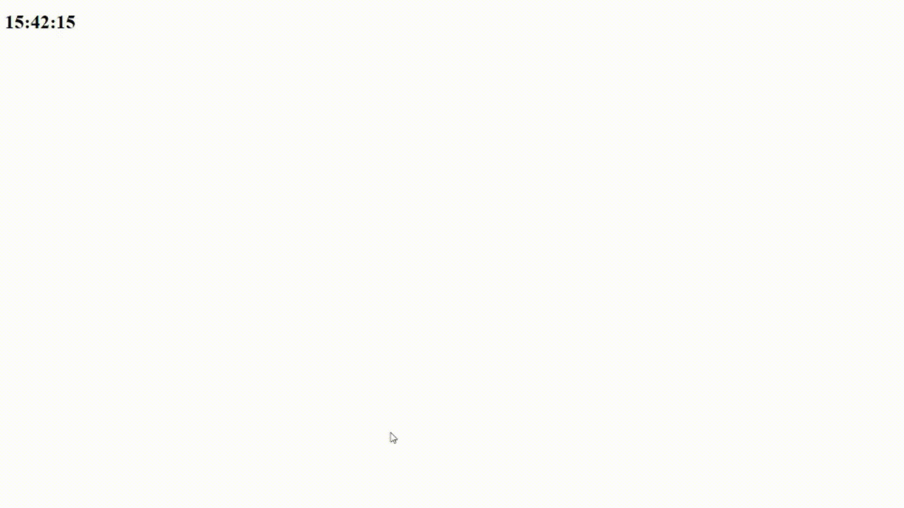

## Web Scraping em tempo real com Node.js :zap:


## Como rodar o projeto :runner:
1. - Instale todas as dependências | ``` npm i ```
2. - Inicie o back-end | ``` npm start ```
3. - Para iniciar o front-end basta abrir o ```app/index.html``` no seu browser